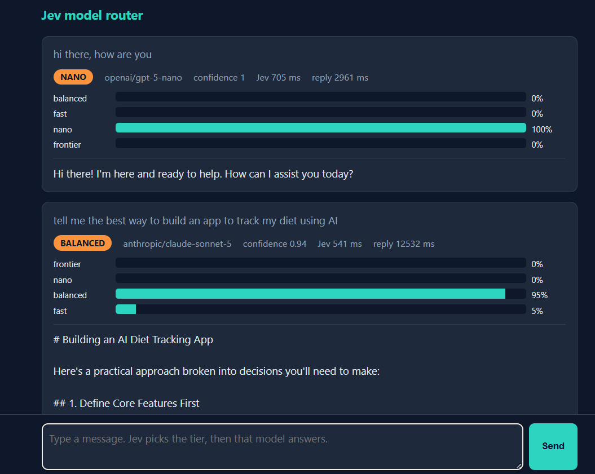
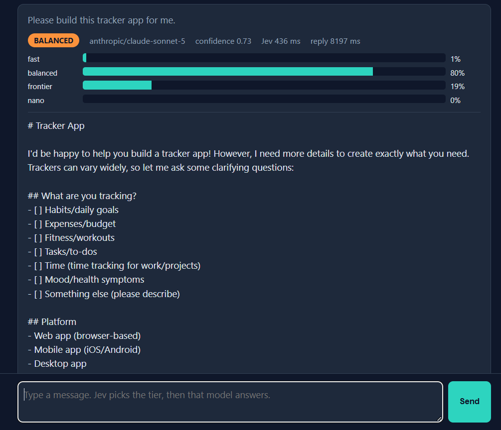

# Jev model router

A small web chat where [Jev](https://docs.typesafe.ai/introduction), TypeSafe's decision model, picks which LLM should answer each message. The chosen model then replies. Both calls go through the [Vercel AI Gateway](https://vercel.com/ai-gateway) with one key.

Inspired by Riley Brown's video [*Jev: the model that can't write*](https://www.youtube.com/watch?v=o1CogAtWdBk), where he builds the same router in one prompt. This repo is that idea, built and documented step by step with Claude Code.

- **Development journey:** https://az9713.github.io/jev-model-router/ — how Jev is reached through the gateway, how the router uses it, where the probabilities come from, what went wrong, and 18 unknown unknowns.
- **Reliability upgrade:** https://az9713.github.io/jev-model-router/reliability-upgrade.html — what changed, why it changed, how it works, and the new evaluation and browser evidence.
- **Email triage journey:** https://az9713.github.io/jev-email-triage/ — in its own repo, [az9713/jev-email-triage](https://github.com/az9713/jev-email-triage). `triage.mjs` over 90 days of a real inbox: how the mail was fetched, the four questions, every input and output file (redacted), four mis-ranks and their causes, and 17 unknown unknowns.
- **Frozen demo:** https://az9713.github.io/jev-model-router/demo.html — a saved copy of the page after three messages.

## What it looks like





## How it works

1. The page posts your message to `POST /chat`.
2. `server.mjs` sends one Choice question to `typesafe-ai/jev` with four options: `nano`, `fast`, `balanced`, `frontier`. Each option has a one-line rubric.
3. Jev returns a probability for every tier and a confidence.
4. The server calls the chosen model with `generateText` and returns the reply, the probabilities, and both timings.

| Tier | Model | Input $/M | Output $/M |
|---|---|---|---|
| nano | `openai/gpt-5-nano` | 0.05 | 0.40 |
| fast | `google/gemini-3-flash` | 0.50 | 3.00 |
| balanced | `anthropic/claude-sonnet-5` | 2.00 | 10.00 |
| frontier | `anthropic/claude-fable-5.1` | 10.00 | 50.00 |

Change the tiers or the question in the `TIERS` and `TIER_QUESTION` blocks at the top of `server.mjs`.

## Run it

Needs Node 20.6 or later and a Vercel AI Gateway key on the paid tier. The free tier limits Jev to a few calls and refuses most reply models.

```
npm install
echo AI_GATEWAY_API_KEY=your_key > .env
node server.mjs --check                  # free offline server check
node --env-file=.env server.mjs           # http://localhost:3000
```

`npm test` runs offline checks and the held-out routing cases without spending API credits. `npm run eval:live` evaluates the same cases with Jev and writes one JSON object per case to `eval/results-live.jsonl`; it does not call any reply model. For the browser flow, start `node server.mjs --offline`, then run `python tests/browser.py` in another terminal.

`probe.mjs` sends one raw Jev call and prints the full response body.

## Cost

One Jev decision: about 340 input tokens at $0.042 per million, about $0.000014. The reply costs whatever the chosen tier costs.
